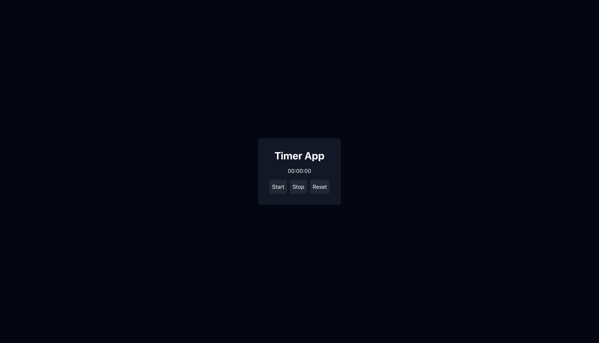

# React Coding Challenge

This is a simple coding challenge to test your React skills. You will be building a simple app that displays a list of items and allows the user to add new items to the list.

## Requirements

- The app should be a functioning timer that counts down from 60 seconds to 0. 
    - The user should be able to start the timer by clicking a button.
    - The user should be able to pause the timer by clicking a button.
    - The user should be able to reset the timer by clicking a button.
    - The functionality should be exposed by a custom hook called `useTimer`.

- The app needs to match the design provided in the mockup below.
    - The app needs to be styled using tailwindcss.

